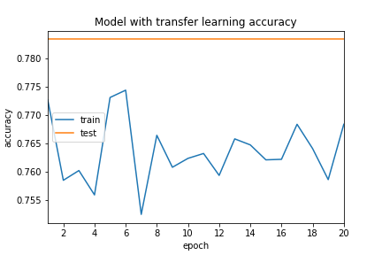

# Tomato-allergies

The full code is available in the file `code.py`

## Requirements

### Files

The 3 files/directories needed to run the code are:
- the directory `assignment_imgs` with the 3000 images
- the file  `img_annotations.json` with all the bounding boxes for the images
- the file `Annotations_with_tomato.txt` with the ID of the bounding boxes that contain or may contain tomato.

### Packages

The project was realized using Tensorflow with Keras.

The following packages are necessary to run the code:

```python
import json
import os
import cv2
import numpy as np
import pandas as pd
from keras.preprocessing.image import ImageDataGenerator
from sklearn.model_selection import train_test_split
from keras.optimizers import Adam
from keras.callbacks import ModelCheckpoint
from keras.applications import VGG16
from keras.models import Sequential
from keras.layers import Dense, Dropout,Flatten, Conv2D, MaxPooling2D, Activation, Add
from matplotlib import pyplot as plt
```

## Annotations_with_tomato.txt file

The file Annotations_with_tomato.txt was made from the file label_mapping.csv. It consist in the list of the ID of the 76 elements that may contain tomatoes that I have identified in the label_mapping list.

## Labels creation

First the path of the needed files need to be set and the `img_annotations.json` and `Annotations_with_tomato.txt` must be opened as follows:

```python
path_to_images = '/.../assignment_imgs/' # (unzipped)
path_to_annotations = '/.../img_annotations.json'
path_to_annotations_tomato = '/.../Annotations_with_tomato.txt'

# Reading of annotation and annotation_tomato files

with open(path_to_annotations) as json_file:
    annotations = json.load(json_file)

f = open(path_to_annotations_tomato, 'r')
annotations_tomato = f.read()
annotations_tomato = annotations_tomato.split('\n')
```

The labels were created as follows:
- 0 if the image does not have any tomato annotation (if none of its bounding boxes annotated ID can be found in the `Annotations_with_tomato.txt` list)
- 1 if the image contain at least 1 annoation with tomato (if at least one bounding box annotated ID can be found in the `Annotations_with_tomato.txt` list)

```python
labels_dict =  {}
for i in range(len(annotations)): 
    labels_dict[list(annotations.items())[i][0]] = 0
    for bbox in list(annotations.items())[i][1]:
        if bbox['id'] in annotations_tomato:
            labels_dict[list(annotations.items())[i][0]] = 1
```
This resulted in having: 
- 2121 images labeled as 0: without any tomato trace
- 879 images labeled as 1: that main contain tomato traces

The images and the labels were then put in corresponding lists of length 3000:
```python
images = []
labels = []

for ID in os.listdir(path_to_images):
    images.append(cv2.imread(path_to_images+ID))
    labels.append(labels_dict[ID])
```
The labels were one hot encoded for easier use:
```python
labels = np.array(labels)
labels = pd.get_dummies(labels).values
```

## Images Pre Processing 

Out of the 3000 images, 13 are not shaped as `600*600*3` : 10 are `600*601*3`, 1 is `600*654*3`, 1 is `600*664*3`, 1 is `986*600*3`.
For simplicity, all the images are reshaped to the same shape.
However the shape was set to `350*350*3` and not `600*600*3` because the RAM offered by colab is not sufficient to handle 3000 `600*600*3` images.

```python
img_dim = 350

for i in range(len(images)):
    if images[i].shape != (img_dim, img_dim, 3):
        images[i] = cv2.resize(images[i],(img_dim, img_dim))
```

Once the images reshaped, their values were normalized between 0 and 1:

```python
images = np.array(images, dtype="float") / 255.0  
```

The data was then split into training and test sets: (since you asked for test accuracy plot, I assumed there was no validation set) 
```python
X_train, X_test, y_train, y_test = train_test_split(images, labels, test_size=0.2)
```
Finally, I proceeded to data augmentation to have more images to train the network
```python
datagen = ImageDataGenerator(rotation_range=40, width_shift_range=0.2,height_shift_range=0.2,
                         shear_range=0.2, zoom_range=0.2,horizontal_flip=True, fill_mode="nearest")
datagen.fit(X_train)
```

## Models

2 models were implemented:
- One trained from scratch
- One involving transfer learning

Three hyperparameters were partially optimized:
- the optimizer between RMSprop, SGD, Adam and Adamax
- the learning rate between 10e-5, 10e-4, 10e-3, 10e-2
- the batch size between 16, 32, 64

```python
batch_size = 64
learning_rate = 0.00001
opt = Adam(lr=learning_rate, decay=learning_rate / 10)
```

### Model from scratch

This model is a CNN with 8 convolutionals layers inspired from the repository mentionned in the credits:

```python
model = Sequential()

model.add(Conv2D(32,  (3, 3), padding='same', input_shape=input_shape, activation='relu'))
model.add(Conv2D(32, (3, 3), padding='same', activation='relu'))
model.add(MaxPooling2D(pool_size=(2, 2)))

model.add(Conv2D(64, (3, 3), padding='same', activation='relu'))
model.add(Dropout(0.2))
model.add(Conv2D(64, (3, 3), padding='same', activation='relu'))
model.add(MaxPooling2D(pool_size=(2, 2)))

model.add(Conv2D(128, (3, 3), padding='same', activation='relu'))
model.add(Dropout(0.2))
model.add(Conv2D(128, (3, 3), padding='same', activation='relu'))
model.add(MaxPooling2D(pool_size=(2, 2)))

model.add(Conv2D(256, (3, 3), padding='same', activation='relu'))
model.add(Dropout(0.2))
model.add(Conv2D(256, (3, 3), padding='same', activation='relu'))
model.add(MaxPooling2D(pool_size=(2, 2)))

model.add(Flatten())
model.add(Dense(512, activation='relu'))
model.add(Dropout(0.5))

model.add(Dense(512, activation='relu'))
model.add(Dropout(0.5))

model.add(Dense(2))
model.add(Activation('softmax'))
```

### Model with transfer learning

The transfer learning was realized using the model VGG16 trained on the ImageNet dataset. The trained weights are frozen up to the last convolutional block. At the end of the network, a classifier adapted to this problem was added. This classifier was first pre trained using bottleneck features from the VGG16 model.


Use of bottleneck features from the VGG16 model:
```python
model_vgg16 = VGG16(include_top=False, weights='imagenet', input_shape=X_train.shape[1:])

train_data = model_vgg16.predict(X_train, len(X_train) // batch_size) 
test_data = model_vgg16.predict(X_test, len(X_test) // batch_size)
```

Creation of the binary classifier adapted to the task:
```python
def classifier(input_shape):
    model = Sequential()
    model.add(Flatten(input_shape=input_shape))
    model.add(Dense(512, activation='relu'))
    model.add(Dropout(0.5))
    model.add(Dense(512, activation='relu'))
    model.add(Dropout(0.5))
    model.add(Dense(2, activation='sigmoid'))
    return model
```

Pretraining of the classifier with the bottleneck features and 50 epochs.
```python
model_classifier = classifier(train_data.shape[1:])
model_classifier.compile(optimizer=opt, loss='binary_crossentropy', metrics=['accuracy'])
model_classifier.fit(train_data, y_train, epochs=50, batch_size=batch_size,
            validation_data=(test_data, y_test))
```
The weights of the classifier were then saved:
```python
model_classifier.save_weights('fc_model.h5')
```

The final model consists in the VVG16 model with its 15 first layers frozen and the pretrained classifier added after:
```python
model = Sequential()

model.add(VGG16(weights='imagenet', include_top=False, input_shape = X_train.shape[1:]))

top_model = classifier(model.output_shape[1:])
top_model.load_weights('fc_model.h5')

model.add(top_model)

for layer in model.layers[:15]:
    layer.trainable = False
    
model.compile(loss='binary_crossentropy', optimizer=opt, metrics=['accuracy'])
```

## Model Training

For the training, the loss function used was the "categorical cross-entropy" as I chose to use a softmax final activation function and one hot encoded labels.

The model trained from scratch was trained with 100 epochs and validation accuracy reached 0.71.

The model with transfer learning was trained with 20 epochs and validation accuracy reached 0.77 (if sigmoid is used instead of softmax and binary cross-entropy instead of categorical cross-entropy, the validation accuracy reaches 0.95, however I think it is incorrect with one hot encoded labels).  

```python
H = model.fit_generator(datagen.flow(X_train, y_train, batch_size=batch_size),
steps_per_epoch=len(X_train) // batch_size, validation_data=(X_test, y_test),
epochs=epochs, verbose=2, callbacks=callbacks)
```
Because of time constraint, I did not perform cross validation and directly used the results from a training on 1 split of the dataset.

## Plots of Training and Test Accuracy



## Checkpoint Release

Please find the release containing the checkpoints for both trained models here :
[release](https://https://github.com/Alexandre185/Tomato-allergies/releases/tag/)

## Credits

https://blog.keras.io/building-powerful-image-classification-models-using-very-little-data.html
(for the use of the bottleneck features and the pretraining of the classifier)

https://github.com/gsurma/image_classifier/blob/master/image_classifier.ipynb
(for the model trained from scratch)
